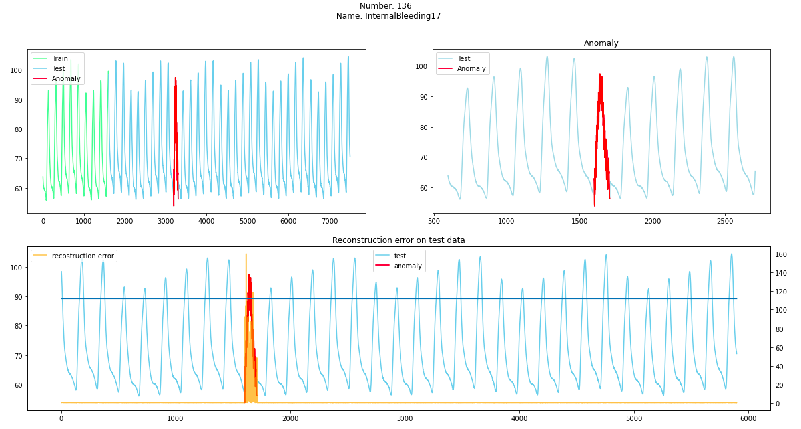

# ucr-dataset-anomaly-detection
 This repository tests whether it is possible to use simple AR model to
 detect anomalies in UCR dataset.
 
## Results
Results can be found in `notebooks` directory.

Here are some of them:
